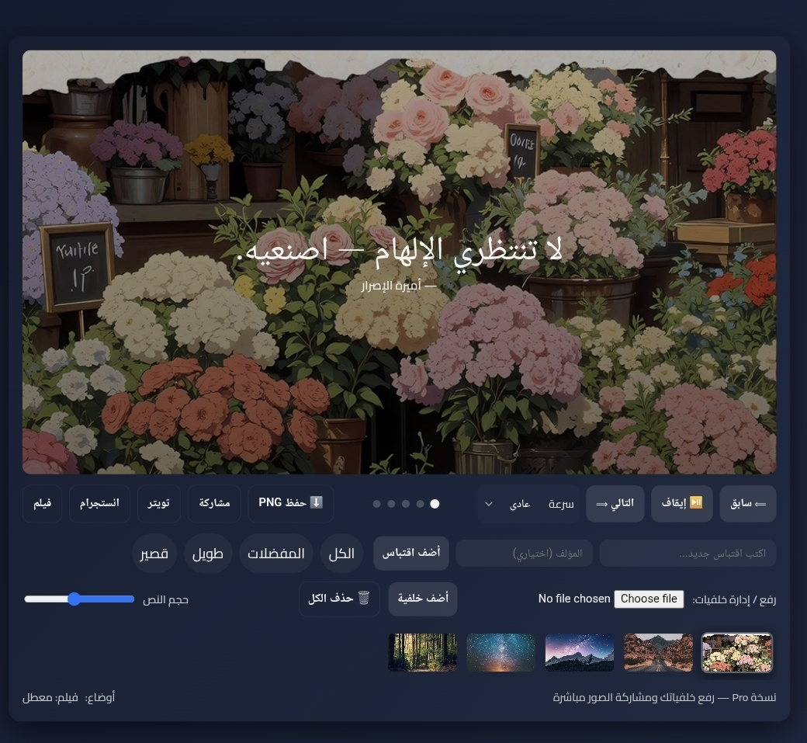

# My Aesthetic Quotes — Pro

A beautiful and interactive web app to display aesthetic quotes in a cinematic style. Users can upload custom backgrounds, share images directly on social media, and control the display speed and font size.

---

## 📌 Features

- Automatic or manual quote navigation with **Previous / Next** buttons.
- Add new user quotes and save them locally.
- Upload personal backgrounds and display them alongside quotes.
- Save quotes as PNG images and share on:
  - Twitter
  - Instagram (or any sharing app)
  - Native sharing via mobile (Web Share API)
- Cinematic effects: **Film / Grain / Vignette**
- Quote filtering:
  - All
  - Favorites
  - Long
  - Short
- Control text size and quote display speed.

---

## 🛠️ Technologies Used

- HTML5 + CSS3 (Flexbox & Grid)
- JavaScript (ES6+)
- LocalStorage for storing user quotes and uploaded backgrounds
- Canvas API for generating downloadable and shareable images
- Google Fonts: Cairo & Playfair Display
- Free background images from Unsplash

---

## ⚡ How to Use

1. Open `index.html` in your browser.
2. You can:
   - Navigate through quotes using the buttons.
   - Add new quotes.
   - Upload your own backgrounds.
   - Adjust font size and display speed.
   - Enable cinematic effects.
   - Save or share the quote image directly.

